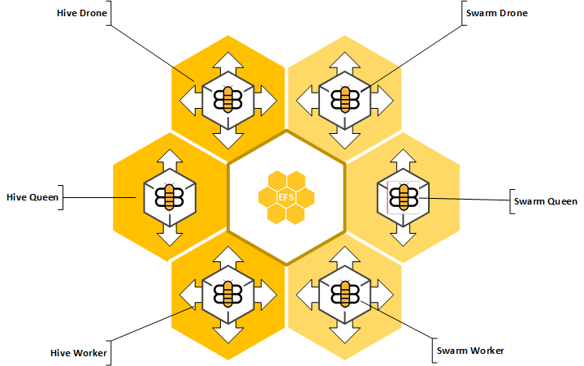

## Hive360 HPCCSystems CloudFormation Deployment Template

### Overview

Hive360 is an cloudformation template to push button create a specially designed HPCCSystems cluster for use on AWS.  The cluster features *push button and dynamic scalability* of thor, roxie, and admin services (both scale up and scale down), high availability across datacenters, is self-healing and dynamic HPCCSystems cluster for big data workflow processing.  Also because of it's architecture, data - regardless of size can be released into roxie in a matter of milliseconds once built on thor.  No more waiting on data releases!  Furthermore, it is designed to be scaled down during periods of inactivity through API calls with a minimum running cost of $139.00/month + $200 per TB of data storage.

It consists of two cloudformation templates and is designed to be run on AWS within a customer VPC which spans multiple AWS availability zones.

The two cloudformation templates are:

- hive360.template
- swarm360.template 

The hive360.template is designed to create the initial "Hive".  It will create a single self-healing "queen" containing the services dali, sasha, dfuserver, esp, eclccserver, eclccscheduler, eclagent and thormaster.  In addition, you are required to specify a number of "workers" eg thorslaves which will be deployed on additional instances.  "Drones" eg roxie will be configured on two additional instances and created in an auto-scaling group and configured to grow on 50% cpu load.  All components are self-healing, even on complete AZ failure.

The swarm360.template is designed to "swarm" an existing "hive".  This will create a completely new environment that shares a common EFS with it's original hive.  All data on the new swarm will be a hard-linked clone of the original hive, therefore not copying or using additional disk space.  Everything, including all workunits that have been run on the original hive will exist on the swarm.  All operations on this new swarm will be independent of the original hive.  Therefore, swarms are perfect for doing development, QA, platform testing and other work where you do not want to affect the original hive but do want to use the production data.  It is important to note that a swarm will be a point in time replica of the original hive.  New files created on the original hive will not be reflected in the swarm.  Swarms are designed to be created and destroyed on need.  You can only have a maximum of 175 swarms connected to the same hive.

Hive uses the AWS Elastic Filesystem service as it's data bus.  There are certain IOPs and throughput limitations on this service that are based on the *total amount of data* that you are storing on the EFS.  Because of this, assume that you will want to have at maximum, only 1 worker per 1TB of data on your hive.  Additional workers added beyond this ratio will only serve to cost you money as the performance benefit will hardly be measurable.  For instance, until you are storing more than 5TB of data, you should always be using the minimum worker size of "5".  If you have > 360TB of data, you can use up to the maximum hive size of 360.
 

See the respective template documentation for a full list of resources and options.

---
### Diagram



---
### Notes

* You must have an existing VPC with multiple subnets across availability zones to use Hive360.

* Workers scale only on factors of 360 with a minimum of 5 (zero is acceptable) eg 5,6,8,9,10,12,15,18,20,24,30,36,40,45,60,72,90,120,180,360

* You must have access to published HPCCSystems approved "Hive360" AMI's with the particular build of HPCCSystems you wish to run.

* Hive360 will create IAM roles to publish HPCC & system logs to cloudwatch.  30 days of logs will be kept by default and can be accessed via cloudwatch logs.

* A minimum hive size will consist of multiple ELBs, ASG, minimum 3 instances of m4.large, EBS volumes, EFS services, and cloudwatch.  You must be prepared for the AWS charges.  LexisNexis is not responsible for any charges you incur by running the hive360.template or swarm360.templates. 

* A limitation of only 175 swarms can be attached to the same hive.

* A limitation of 8 exabytes of data per hive.  No need to scale space, you are charged only for what you use.

---
### Use Cases

* Hives are particularly useful to put big data processing into existing workflows.  The primary example is input data being dropped off on a periodic basis.  Scheduled jobs detect new data, make a simple API call in to the cloudformation stack to increase the hive size from '0' to 'X' depending on the processing needs, command line ECL submits the ECL code to the queen, job blocks until the hive workers come online (minute or so), job monitors the status of the workunit until completed, job creates package file and releases to roxie, job makes cloudformation stack call to reduce the size of the cluster from "X" to 0.  You are only charged for the amount of time the workers are being used.

* Swarms are useful for new development work.  Developer creates their own personal swarm (with their own user/password) to do some testing of ECL code.  All production data is avaialable to the developer, but they cannot delete it (although overwrites are still dangerous). When complete developer destroys the swarm.

* Batch processing.  Swarms can be spawned to process batch jobs on thor.  Once the batch job completes and data is "desprayed", the swarm can be destroyed.  Depending on the size of the batch job and the timeframe to complete it, swarms can be spawned of various sizes and measurable costs.

* New platform releases and testing has never been easier!  Swarms do not need to be running the same platform code as the Hive.  Release 7.x gold comes out? Simply swarm the hive on version 7.x and run your production code to make sure it still works.  When done, destroy the swarm and make a call into the stack to update the AMI of the hive to version 7.x.  Hive handles the rollout.

* All releases to the drones - platform or otherwise, follow stringent rollout releases.  New drones are first created with the new build, put behind the load balancers and once healthy, the old drones are drained of new connections and destroyed automatically.  If something goes wrong and the new drones fail to operate correctly, the system automatically rolls back the release.  Like having your own personal HPCC operations staff!

* If any component fails due to a datacenter outage, or hypervisor failure on AWS - replacements are spun up automatically and reconfigured to work in the hive or swarm.  Generally this takes less than a few minutes.  Drones are automatically spanned across multiple datacenters and will continue to provide services even in the event of a datacenter failure.

---
### Considerations

* AWS charges on a per hour basis, regardless if you use an instance for 59 minutes or 1 minute.  If workflow processing time is not a business priority, it is best to scale your workers to a size that finishes the particular job in as close to hour as possible without going over.  In other words, if time is not a priority, it makes fiscal sense to use 5 workers to complete the job in 59 minutes than 20 workers to complete the job in 15 minutes.  

---
### Usage

Clone the repository to a local cloudformation working directory.

You will need the AWS CLI Command line tools or you can use the AWS Web Console.

```shell
$ GIT_SSL_NO_VERIFY=true git clone https://gitlab.ins.risk.regn.net/BurgerJX/hive360.git
```

Configuration options are controlled through cloudformation parameters.

Once the configuration is set, run `create-stack`, followed by a `update-stack` to make changes.

```shell
$ create-stack --stack-name <value> --parameters <list>
```

The access key must have permissions to create defined resources. See cloudformation documentation for additional credential load options.

---

### Variables

| **Variable**                | **Subsystem**  | **Assignment** | **Type**  | **Description**              | **Default**  |
| :------------------------   | :------------: | :------------: | :-------: | :-------------------------   | :----------: |
| `AMI   `                    | hive360        | required       | string    | id of the HPCC AMI Build     |              |
| `Password`                  | hive360        | required       | string    | the password for the ecl-user|              |
| `VPC`                       | hive360        | required       | string    | the VPC Id                   |              |
| `PrivateSubnetA`            | hive360        | required       | string    | subnet in first AZ           |              |
| `PrivateSubnetB`            | hive360        | required       | string    | subnet in second AZ          |              |
| `QueenSize`                 | hive360        | required       | string    | size of the admin node(s)    |              |
| `WorkerSize`                | hive360        | required       | string    | size of the thor node(s)     |              |
| `DroneSize`                 | hive360        | required       | string    | size of the roxie node(s)    |              |
| `WorkerCount`               | hive360        | required       | string    | count of the thor nodes      |              |
| `DroneCount`                | hive360        | required       | string    | mimimum number of roxie nodes|              |


---

### Dependencies

If run from the command line AWS CLI tools are required.

 - VPC (multiple subnets)
